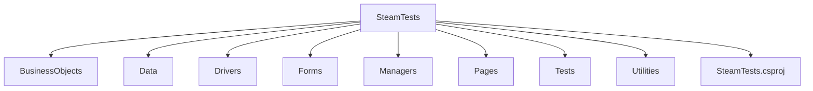

# SteamTests

## Описание

SteamTests — проект для автоматизированного UI-тестирования сайта Steam.

Проект предназначен для проверки основных пользовательских сценариев с использованием Selenium WebDriver и NUnit.

Автоматизированные тесты проверяют:

* навигацию между страницами Steam;
* фильтрацию игр в разделе «Лидеры продаж»;
* поиск предметов в Community Market;
* соответствие отображаемых данных ожидаемым значениям.

## Требования

Для запуска проекта необходимо установить:

* Git;
* .NET SDK 10.0;
* Google Chrome.

Все NuGet-зависимости проекта указаны в `SteamTests.csproj` и автоматически восстанавливаются при выполнении `dotnet restore`.

## Установка

### Клонирование репозитория

```bash
git clone https://github.com/zz21m/steam_UI_tests.git
```

### Запуск из консоли

Перейти в директорию проекта:

```bash
cd steam_UI_tests
```

Из корневой директории репозитория выполнить:

```bash
dotnet restore SteamTests/SteamTests.csproj
```

Для запуска всех автоматизированных тестов выполнить:

```bash
dotnet test SteamTests/SteamTests.csproj
```

### Запуск из IDE

Открыть склонированный репозиторий в IDE.

Открыть файл проекта:

```text
SteamTests/SteamTests.csproj
```

После загрузки проекта запустить тесты через средство запуска тестов IDE.

## Структура проекта



## Тестовые сценарии

### PlayersCountAndNavigation

Проверяет количество игроков на странице About и переход обратно на страницу магазина.

### BestSellersFiltering

Открывает раздел "Лидеры продаж", применяет фильтры, проверяет количество результатов и данные первой игры.

### MarketSearch

Открывает Community Market, применяет параметры поиска, проверяет результаты и данные первого предмета.
